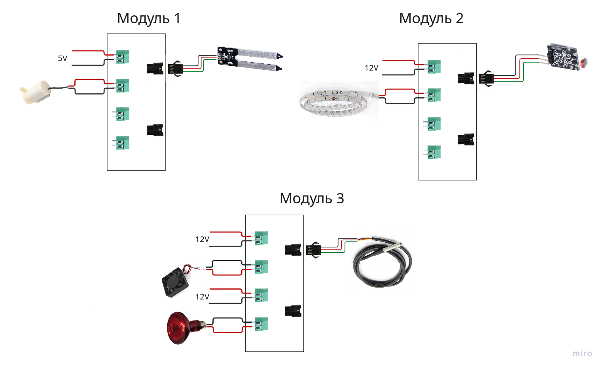
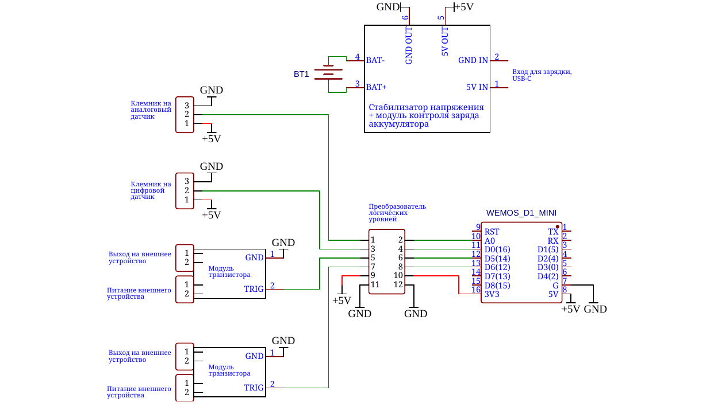

# Автоматизированная система управления теплицей

## 1. Титульный лист
Автоматизированная система управления теплицей на базе Raspberry Pi и модулей ESP8266.
Команда: 
- Васильев Никита, Брель Мария — веб‑интерфейс
- Таджединов Рамиль, Шмунк Андрей — бэкэнд, железо
- Ступин Тимур — 3D, железо

## 2. Описание проекта
### Актуальность и проблематика
Поддержание стабильного микроклимата в теплицах критично для урожайности. Ручное управление неэффективно и трудозатратно. Необходима доступная, гибкая и автономная система, которую можно настраивать без перепрошивки оборудования и которая работает в локальной сети.

### Краткое описание проекта
Система централизованно собирает данные с датчиков (температура, освещённость, уровень воды, влажность почвы) и управляет исполнительными устройствами (помпы, вентиляторы, освещение). Переназначение функций модулей доступно через веб‑интерфейс. Обмен между сервером и модулями — по HTTP/REST.

### Цель проекта
Создать автономную и настраиваемую систему управления микроклиматом теплицы, работающую на Raspberry Pi и универсальных модулях ESP8266, с удобным веб‑интерфейсом и гибкой конфигурацией без перепрошивки.

### Задачи для достижения поставленной цели
- Спроектировать архитектуру и взаимодействие центрального сервера с модулями.
- Реализовать чтение данных с датчиков и управление исполнительными устройствами.
- Разработать веб‑интерфейс для конфигурации модулей и мониторинга.
- Обеспечить автономную работу в локальной сети.
- Реализовать логирование событий.
- Подготовить документацию и схемы подключения.

## 3. Техническое задание
### Команда исполнителей
- Васильев Никита, Брель Мария — frontend
- Таджединов Рамиль, Шмунк Андрей — backend и аппаратная часть
- Ступин Тимур — 3D и аппаратная часть

### Технические требования
- Сбор данных: температура, освещённость, уровень воды, влажность почвы.
- Управление: помпы, вентиляторы, освещение.
- Конфигурирование: переназначение функций модулей через веб‑интерфейс.
- Доступ: LAN/Internet.
- Логирование: журнал событий.
- Надёжность: автономность в LAN, устойчивость при сбоях, защита компонентов.
- Условия эксплуатации: +5…+50 °C, влажность до 95%, питание 12V.
- Состав средств: Raspberry Pi 5, ESP8266, сенсоры (ds18b20, фоторезистор, датчик влажности почвы), исполнительные — 12V устройства через MOSFET.
- Совместимость: связь по Wi‑Fi; frontend — HTML5/JS (HTTP), backend — API и управление; модули — ESP8266 по REST.
- Подключение: сенсоры (аналоговые/цифровые) — 3 вывода (5V, сигнал, земля); исполнительные — через MOSFET (земля, питание).

### Требования к документации
- Руководство пользователя.
- Программная документация:
  - Описание архитектуры системы (см. doc/arc.md).
  - REST‑спецификация API.
  - Протоколы взаимодействия модулей.
- Схемы подключения датчиков и исполнительных устройств.

### Технико‑экономические показатели

| Название | Цена шт | Количество | Цена итог |
|----------|---------|------------|-----------|
| WEMOS D1 MINI | 208 | 3 | 624 |
| модуль транзистора | 40 | 6 | 240 |
| разъемы под датчики | 41,4 | 6 | 248,4 |
| провод 0.07 мгтф | 127 | 1 | 127 |
| провод 0.5 мгтф | 381 | 1 | 381 |
| преобразователь логических уровней | 99 | 3 | 297 |
| Модуль контроля заряда | 50 | 3 | 150 |
| Модуль фоторезистора | 40 | 1 | 40 |
| мяу аккумятор | 369 | 3 | 1107 |
| датчик температуры | 207 | 1 | 207 |
| помпа | 115 | 1 | 115 |
| датчик влажности почвы | 119 | 1 | 119 |
| лента светодиодная | 0 | 1 | 0 |
| кулер | 132 | 1 | 132 |
| блок питания 12V | 270 | 1 | 270 |
| **Итого:** | | | **4057,4 ₽** |

### Стадии и этапы разработки
1. Анализ требований и проектирование.
2. Разработка прототипа: взаимодействие ESP‑модулей с сервером.
3. Разработка веб‑интерфейса.
4. Тестирование взаимодействия компонентов системы.
5. Подготовка документации.
6. Защита проекта.

### Порядок контроля и приемки
- Функциональные испытания: чтение данных с датчиков и управление.
- Надёжность: устойчивость при сбоях связи/питания, автономность.
- Эксплуатационные: работа при высокой влажности и температуре.
- Приёмка: подтверждение соответствия ТЗ, успешные испытания, акт приёмки.

## 4. Описание архитектуры проекта
### Диаграмма архитектуры устройства

**Структура модулей системы:**

**Схема подключения модулей, сенсоров и исполнительных устройств:**

### Краткое текстовое описание архитектуры проекта
- Центральный сервер (Raspberry Pi 5) предоставляет HTTP API, хранит конфигурации и логи, оркестрирует выполнение автоматических сценариев.
- Модули ESP8266 подключены по Wi‑Fi, выполняют роли датчиков (отдающих) и исполнительных устройств (принимающих), взаимодействуют через REST.
- Frontend (HTML5/JS) обеспечивает пользовательский интерфейс для мониторинга и настройки, общается с backend по HTTP.
- Исполнительные устройства управляются через MOSFET‑модули; сенсоры подключаются к аналоговым/цифровым портам (5V, сигнал, земля).

## 5. Краткое руководство по эксплуатации проекта
- Подключить модули ESP и исполнительные устройства согласно схемам.
- Запустить центральный сервер на Raspberry Pi 5.
- Открыть веб‑интерфейс и настроить привязку сенсоров/актуаторов к модулям.
- Проверить чтение данных и работу автоматических сценариев.
- Следить за журналом событий; при необходимости вносить изменения через веб‑интерфейс.

## 6. Описание хода выполнения работы
- Проведён анализ требований, спроектирована архитектура.
- Разработан прототип взаимодействия: сервер на Raspberry Pi + ESP‑модули.
- Разработан веб‑интерфейс и backend, реализовано взаимодействие по REST.
- Реализовано управление исполнительными устройствами через модули.
- Проведено тестирование взаимодействия модулей и автономной работы в локальной сети.
- Подготовлены схемы и документация.
- Зафиксированы возникавшие проблемы (связь, питание) и решения (автономный режим, устойчивость к сбоям).

## 7. Описание результатов проведённой работы и перспективы
- Реализована базовая система мониторинга и управления микроклиматом теплицы.
- Обеспечена гибкая перенастройка модулей через веб‑интерфейс без перепрошивки.
- Обеспечена автономная работа в локальной сети и логирование.
- Перспективы: расширение набора сенсоров/актуаторов, улучшение UI, правила автоматизации с планировщиком, анализ данных и прогнозирование, поддержка интеграций.

## 8. Используемые источники
1. ГОСТ 19.201‑78 "Техническое задание. Требования к содержанию и оформлению".
2. Внутренние материалы проекта: doc/arc.md, REST‑спецификация API, схемы подключения.
